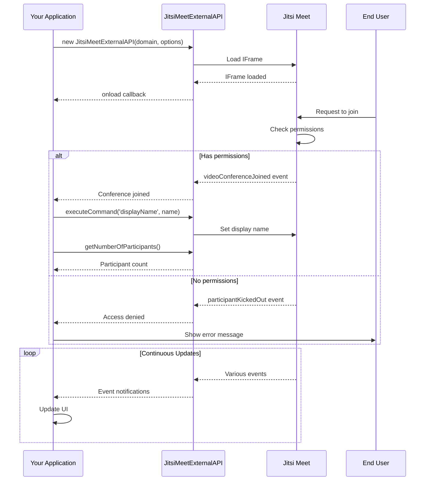
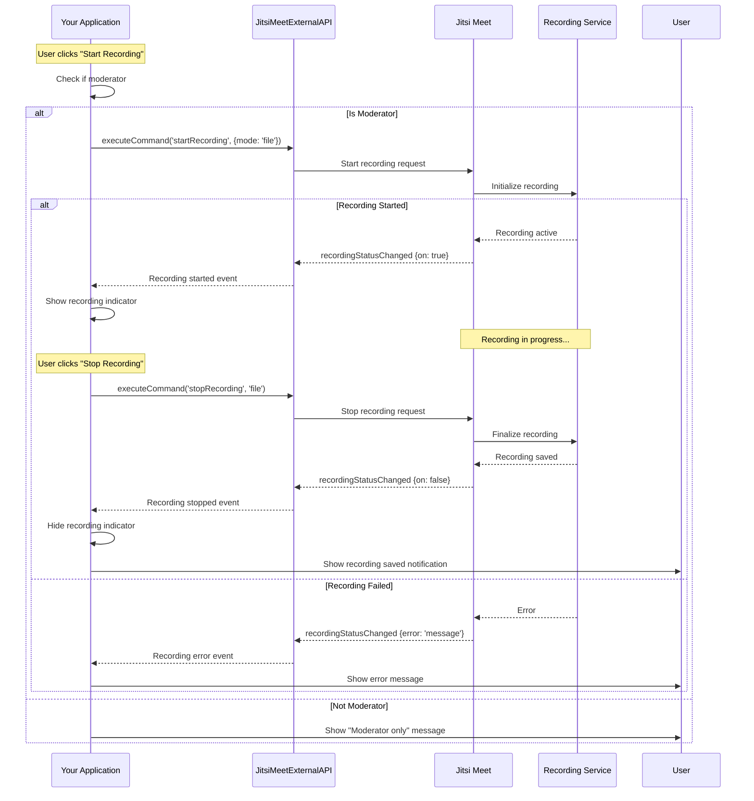
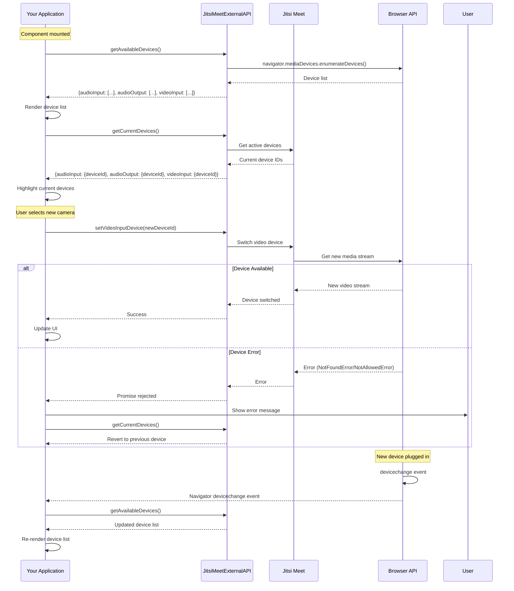
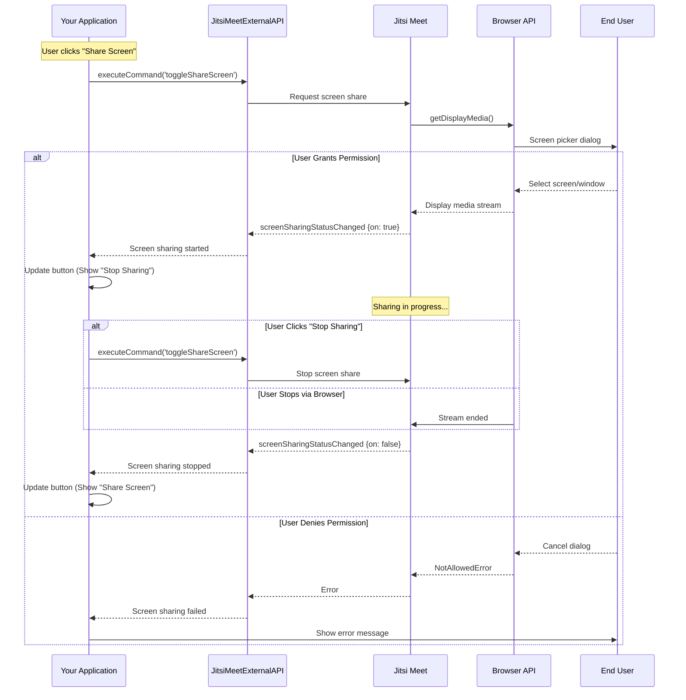
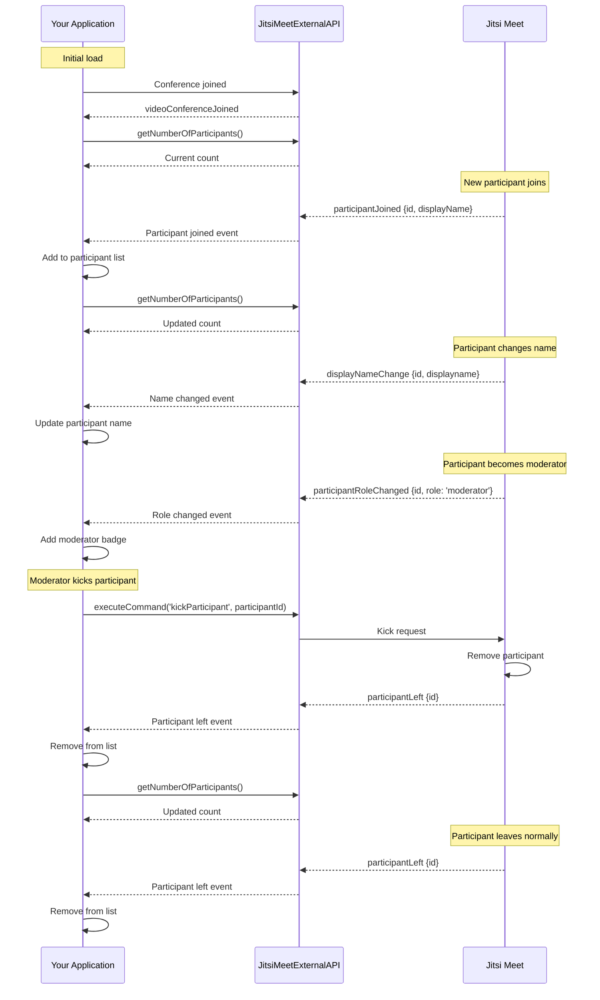
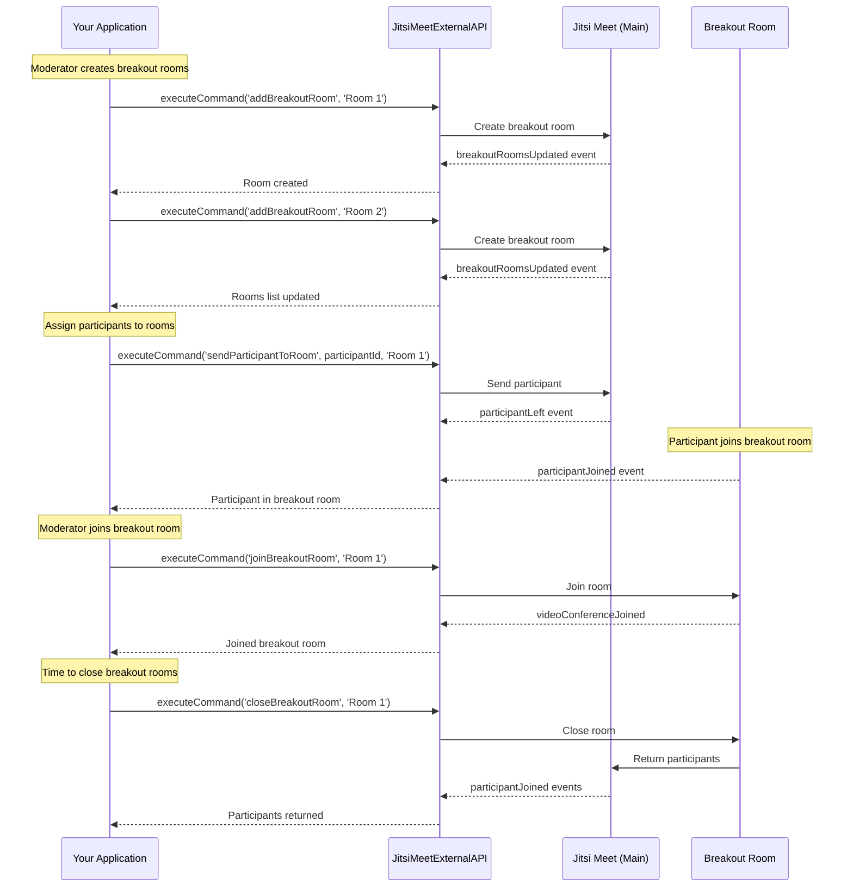
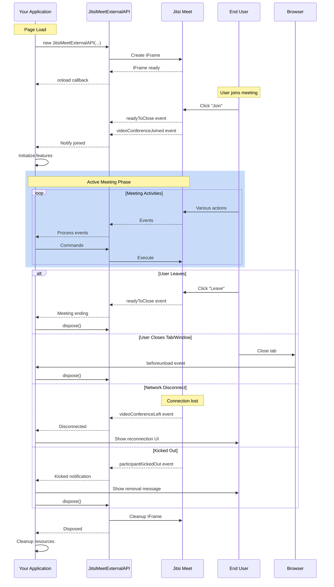

This guide provides visual representations of common integration workflows and interaction patterns with the Jitsi Meet IFrame API.

## Table of Contents

- [Conference Join Flow](#conference-join-flow)
- [Recording Workflow](#recording-workflow)
- [Device Switching Flow](#device-switching-flow)
- [Screen Sharing Workflow](#screen-sharing-workflow)
- [Participant Management Flow](#participant-management-flow)
- [Breakout Rooms Workflow](#breakout-rooms-workflow)
- [Complete Meeting Lifecycle](#complete-meeting-lifecycle)

---

## Conference Join Flow

This diagram shows the typical sequence when a user joins a conference:



**Implementation:**

```javascript
const api = new JitsiMeetExternalAPI('meet.jit.si', {
    roomName: 'MyRoom',
    parentNode: document.querySelector('#meet'),
    userInfo: {
        displayName: 'John Doe',
        email: 'john@example.com'
    }
});

// Listen for successful join
api.addEventListener('videoConferenceJoined', async () => {
    console.log('Successfully joined!');
    
    // Set display name if needed
    api.executeCommand('displayName', 'John Doe');
    
    // Get participant count
    const count = await api.getNumberOfParticipants();
    console.log(`${count} participants in the room`);
});

// Handle join failure
api.addEventListener('participantKickedOut', () => {
    console.error('Failed to join: Access denied');
    alert('You do not have permission to join this meeting');
});
```

---

## Recording Workflow

Complete recording lifecycle from start to stop:



**Implementation:**

```javascript
// Check moderator status first
let isModerator = false;

api.addEventListener('participantRoleChanged', ({ role }) => {
    isModerator = (role === 'moderator');
});

async function startRecording() {
    if (!isModerator) {
        alert('Only moderators can start recording');
        return;
    }
    
    try {
        await api.executeCommand('startRecording', {
            mode: 'file'  // or 'stream' for RTMP
        });
    } catch (error) {
        console.error('Failed to start recording:', error);
        alert('Recording failed to start');
    }
}

// Listen for recording status
api.addEventListener('recordingStatusChanged', ({ on, mode, error }) => {
    if (error) {
        console.error('Recording error:', error);
        alert(`Recording error: ${error}`);
    } else if (on) {
        console.log(`Recording started (${mode})`);
        showRecordingIndicator();
    } else {
        console.log('Recording stopped');
        hideRecordingIndicator();
        alert('Recording saved successfully');
    }
});

async function stopRecording() {
    try {
        await api.executeCommand('stopRecording', 'file');
    } catch (error) {
        console.error('Failed to stop recording:', error);
    }
}
```

---

## Device Switching Flow

Handling device enumeration and switching:



**Implementation:**

```javascript
class DeviceManager {
    constructor(api) {
        this.api = api;
        this.init();
    }
    
    async init() {
        // Load initial devices
        await this.refreshDevices();
        
        // Listen for device changes
        navigator.mediaDevices.addEventListener('devicechange', async () => {
            console.log('Device change detected');
            await this.refreshDevices();
        });
    }
    
    async refreshDevices() {
        try {
            // Get all available devices
            const available = await this.api.getAvailableDevices();
            
            // Get currently active devices
            const current = await this.api.getCurrentDevices();
            
            // Update UI
            this.renderDeviceSelectors(available, current);
        } catch (error) {
            console.error('Failed to refresh devices:', error);
        }
    }
    
    async switchCamera(deviceId) {
        try {
            await this.api.setVideoInputDevice(deviceId);
            console.log('Camera switched successfully');
        } catch (error) {
            if (error.name === 'NotFoundError') {
                alert('Camera not found. Please check your device.');
            } else if (error.name === 'NotAllowedError') {
                alert('Camera access denied. Please grant permissions.');
            } else {
                alert('Failed to switch camera. Please try again.');
            }
            
            // Revert to previous device
            const current = await this.api.getCurrentDevices();
            this.updateUI(current);
        }
    }
    
    renderDeviceSelectors(available, current) {
        // Render microphones
        this.renderSelect('microphones', available.audioInput, 
                         current.audioInput?.deviceId);
        
        // Render speakers
        this.renderSelect('speakers', available.audioOutput, 
                         current.audioOutput?.deviceId);
        
        // Render cameras
        this.renderSelect('cameras', available.videoInput, 
                         current.videoInput?.deviceId);
    }
}
```

---

## Screen Sharing Workflow

Screen sharing initiation and management:



**Implementation:**

```javascript
let isSharingScreen = false;

function toggleScreenShare() {
    api.executeCommand('toggleShareScreen');
}

api.addEventListener('screenSharingStatusChanged', ({ on, details }) => {
    isSharingScreen = on;
    
    const btn = document.querySelector('#screenShareBtn');
    
    if (on) {
        btn.textContent = '🛑 Stop Sharing';
        btn.className = 'btn btn-danger';
        console.log('Screen sharing started');
        
        // Show who is sharing
        if (details && details.sourceType) {
            console.log(`Sharing: ${details.sourceType}`); // 'screen', 'window', or 'tab'
        }
    } else {
        btn.textContent = '📺 Share Screen';
        btn.className = 'btn btn-primary';
        console.log('Screen sharing stopped');
    }
});

// Handle errors
api.addEventListener('errorOccurred', ({ error }) => {
    if (error.includes('screenshare')) {
        alert('Screen sharing failed. Please grant permission and try again.');
    }
});
```

---

## Participant Management Flow

Managing participants throughout their lifecycle:



**Implementation:**

```javascript
class ParticipantManager {
    constructor(api) {
        this.api = api;
        this.participants = new Map();
        this.isModerator = false;
        
        this.setupListeners();
    }
    
    setupListeners() {
        // Track when participants join
        this.api.addEventListener('participantJoined', ({ id, displayName }) => {
            this.addParticipant(id, displayName);
        });
        
        // Track when participants leave
        this.api.addEventListener('participantLeft', ({ id }) => {
            this.removeParticipant(id);
        });
        
        // Track name changes
        this.api.addEventListener('displayNameChange', ({ id, displayname }) => {
            this.updateParticipantName(id, displayname);
        });
        
        // Track role changes
        this.api.addEventListener('participantRoleChanged', ({ id, role }) => {
            if (id === this.getLocalParticipantId()) {
                this.isModerator = (role === 'moderator');
            }
            this.updateParticipantRole(id, role);
        });
    }
    
    addParticipant(id, displayName) {
        this.participants.set(id, {
            id,
            displayName: displayName || 'Guest',
            role: 'participant'
        });
        
        console.log(`Participant joined: ${displayName} (${id})`);
        this.render();
    }
    
    removeParticipant(id) {
        const participant = this.participants.get(id);
        if (participant) {
            console.log(`Participant left: ${participant.displayName}`);
            this.participants.delete(id);
            this.render();
        }
    }
    
    updateParticipantName(id, displayName) {
        const participant = this.participants.get(id);
        if (participant) {
            participant.displayName = displayName;
            this.render();
        }
    }
    
    updateParticipantRole(id, role) {
        const participant = this.participants.get(id);
        if (participant) {
            participant.role = role;
            this.render();
        }
    }
    
    kickParticipant(participantId) {
        if (!this.isModerator) {
            alert('Only moderators can kick participants');
            return;
        }
        
        const participant = this.participants.get(participantId);
        if (participant && confirm(`Kick ${participant.displayName}?`)) {
            this.api.executeCommand('kickParticipant', participantId);
        }
    }
    
    render() {
        const container = document.querySelector('#participants');
        let html = '<h3>Participants (' + this.participants.size + ')</h3>';
        
        this.participants.forEach(p => {
            const roleIcon = p.role === 'moderator' ? '👑' : '👤';
            const kickBtn = this.isModerator ? 
                `<button onclick="manager.kickParticipant('${p.id}')">❌</button>` : '';
            
            html += `
                <div class="participant">
                    <span>${roleIcon} ${p.displayName}</span>
                    ${kickBtn}
                </div>
            `;
        });
        
        container.innerHTML = html;
    }
}

const manager = new ParticipantManager(api);
```

---

## Breakout Rooms Workflow

Managing breakout rooms:



**Implementation:**

```javascript
class BreakoutRoomManager {
    constructor(api) {
        this.api = api;
        this.rooms = new Map();
        
        this.api.addEventListener('breakoutRoomsUpdated', ({ rooms }) => {
            this.updateRooms(rooms);
        });
    }
    
    async createRoom(roomName) {
        try {
            await this.api.executeCommand('addBreakoutRoom', roomName);
            console.log(`Breakout room created: ${roomName}`);
        } catch (error) {
            console.error('Failed to create room:', error);
        }
    }
    
    async sendParticipantToRoom(participantId, roomName) {
        try {
            await this.api.executeCommand('sendParticipantToRoom', 
                                         participantId, roomName);
            console.log(`Sent participant to ${roomName}`);
        } catch (error) {
            console.error('Failed to send participant:', error);
        }
    }
    
    async joinRoom(roomName) {
        try {
            await this.api.executeCommand('joinBreakoutRoom', roomName);
            console.log(`Joined breakout room: ${roomName}`);
        } catch (error) {
            console.error('Failed to join room:', error);
        }
    }
    
    async closeRoom(roomName) {
        try {
            await this.api.executeCommand('closeBreakoutRoom', roomName);
            console.log(`Closed breakout room: ${roomName}`);
        } catch (error) {
            console.error('Failed to close room:', error);
        }
    }
    
    updateRooms(rooms) {
        this.rooms = new Map(rooms.map(r => [r.id, r]));
        this.render();
    }
    
    render() {
        // Render breakout rooms UI
    }
}
```

---

## Complete Meeting Lifecycle

End-to-end meeting flow from initialization to cleanup:



**Implementation:**

```javascript
class MeetingManager {
    constructor(domain, roomName, options = {}) {
        this.domain = domain;
        this.roomName = roomName;
        this.api = null;
        this.isActive = false;
        
        this.init(options);
        this.setupCleanup();
    }
    
    init(options) {
        // Create API instance
        this.api = new JitsiMeetExternalAPI(this.domain, {
            roomName: this.roomName,
            parentNode: document.querySelector('#meet'),
            ...options
        });
        
        // Setup event listeners
        this.api.addEventListener('videoConferenceJoined', () => {
            this.onJoined();
        });
        
        this.api.addEventListener('videoConferenceLeft', () => {
            this.onLeft();
        });
        
        this.api.addEventListener('readyToClose', () => {
            this.cleanup();
        });
        
        this.api.addEventListener('participantKickedOut', () => {
            this.onKickedOut();
        });
    }
    
    onJoined() {
        this.isActive = true;
        console.log('Meeting started');
        
        // Initialize meeting features
        this.initializeFeatures();
    }
    
    onLeft() {
        this.isActive = false;
        console.log('Left meeting');
        
        // Show post-meeting UI
        this.showPostMeetingScreen();
    }
    
    onKickedOut() {
        this.isActive = false;
        console.log('Kicked from meeting');
        alert('You have been removed from the meeting');
        this.cleanup();
    }
    
    initializeFeatures() {
        // Initialize participant tracking
        // Initialize device management
        // Initialize UI controls
        // etc.
    }
    
    setupCleanup() {
        // Cleanup when page unloads
        window.addEventListener('beforeunload', () => {
            this.cleanup();
        });
        
        // Cleanup on navigation
        window.addEventListener('popstate', () => {
            this.cleanup();
        });
    }
    
    cleanup() {
        if (this.api) {
            console.log('Cleaning up API resources');
            this.api.dispose();
            this.api = null;
        }
        
        this.isActive = false;
        
        // Cleanup any other resources
        // Remove event listeners
        // Clear intervals/timeouts
        // etc.
    }
    
    leave() {
        if (this.isActive && this.api) {
            this.api.executeCommand('hangup');
        }
    }
    
    showPostMeetingScreen() {
        // Show feedback form, meeting summary, etc.
        document.querySelector('#post-meeting').style.display = 'block';
    }
}

// Usage
const meeting = new MeetingManager('meet.jit.si', 'MyMeeting', {
    userInfo: {
        displayName: 'John Doe',
        email: 'john@example.com'
    }
});

// Leave button
document.querySelector('#leaveBtn').onclick = () => {
    meeting.leave();
};
```

---

## Best Practices

### Event Handling
1. **Always remove listeners** when components unmount
2. **Use debouncing** for frequent events (e.g., audio levels)
3. **Handle all error cases** in event callbacks

### Command Execution
1. **Check permissions** before executing privileged commands
2. **Use async/await** with proper error handling
3. **Validate parameters** before sending commands

### Resource Management
1. **Always call dispose()** before page unload
2. **Clean up timers** and intervals
3. **Remove event listeners** to prevent memory leaks

### Performance
1. **Batch UI updates** instead of updating on every event
2. **Cache device lists** to avoid repeated queries
3. **Use requestAnimationFrame** for smooth animations

---

**See also:**
- [Quick Start Guide](iframe-quick-start.md)
- [Commands Reference](iframe-commands.md)
- [Functions Reference](iframe-functions.md)
- [Events Reference](iframe-events.md)
