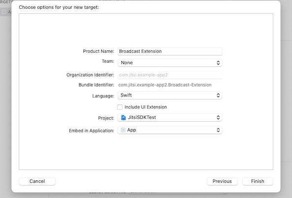
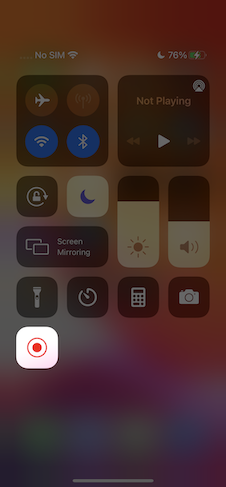

The Jitsi Meet iOS SDK provides the same user experience as the Jitsi Meet app,
in a customizable way which you can embed in your apps.

:::important
iOS 12 or higher is required.
:::

## Sample applications using the SDK

If you want to see how easy integrating the Jitsi Meet SDK into a native application is, take a look at the
[sample applications repository](https://github.com/jitsi/jitsi-meet-sdk-samples).

## Usage

There are 2 ways to integrate the SDK into your project:

- Using CocoaPods
- Building it yourself

### Using CocoaPods

The recommended way for using the SDK is by using CocoaPods. In order to
do so, add the `JitsiMeetSDK` dependency to your existing `Podfile` or create
a new one following this example:

```
platform :ios, '12.0'

workspace 'JitsiMeetSDKTest.xcworkspace'

target 'JitsiMeetSDKTest' do
  project 'JitsiMeetSDKTest.xcodeproj'

  pod 'JitsiMeetSDK'
end

post_install do |installer|
  installer.pods_project.targets.each do |target|
    target.build_configurations.each do |config|
      config.build_settings['ENABLE_BITCODE'] = 'NO'
    end
  end
end
```

Replace `JitsiMeetSDKTest` with your project and target names.

Bitcode is not provided in the prebuilt SDK, so turn it off for your project.

The SDK uses Swift code, so make sure you select `Always Embed Swift Standard Libraries`
in your project.

Since the SDK requests camera and microphone access, make sure to include the
required entries for `NSCameraUsageDescription` and `NSMicrophoneUsageDescription`
in your `Info.plist` file.

In order for app to properly work in the background, select the "audio" and "voip"
background modes.

Last, since the SDK shows and hides the status bar based on the conference state,
you may want to set `UIViewControllerBasedStatusBarAppearance` to `NO` in your
`Info.plist` file.

### Building it yourself

1. Install all required [dependencies](https://jitsi.github.io/handbook/docs/dev-guide/dev-guide-mobile-jitsi-meet).

2. Build it:

```bash
mkdir -p ios/sdk/out
xcodebuild clean \
    -workspace ios/jitsi-meet.xcworkspace \
    -scheme JitsiMeetSDK
xcodebuild archive \
    -workspace ios/jitsi-meet.xcworkspace \
    -scheme JitsiMeetSDK  \
    -configuration Release \
    -sdk iphonesimulator \
    -destination='generic/platform=iOS Simulator' \
    -archivePath ios/sdk/out/ios-simulator \
    VALID_ARCHS=x86_64 \
    ENABLE_BITCODE=NO \
    SKIP_INSTALL=NO \
    BUILD_LIBRARY_FOR_DISTRIBUTION=YES
xcodebuild archive \
    -workspace ios/jitsi-meet.xcworkspace \
    -scheme JitsiMeetSDK  \
    -configuration Release \
    -sdk iphoneos \
    -destination='generic/platform=iOS' \
    -archivePath ios/sdk/out/ios-device \
    VALID_ARCHS=arm64 \
    ENABLE_BITCODE=NO \
    SKIP_INSTALL=NO \
    BUILD_LIBRARY_FOR_DISTRIBUTION=YES
xcodebuild -create-xcframework \
    -framework ios/sdk/out/ios-device.xcarchive/Products/Library/Frameworks/JitsiMeetSDK.framework \
    -framework ios/sdk/out/ios-simulator.xcarchive/Products/Library/Frameworks/JitsiMeetSDK.framework \
    -output ios/sdk/out/JitsiMeetSDK.xcframework
cp -a node_modules/react-native-webrtc/apple/WebRTC.xcframework ios/sdk/out
```

After successfully building Jitsi Meet SDK for iOS, the 2 resulting XCFrameworks will be in the ios/sdk/out directory.

## API

JitsiMeet is an iOS framework which embodies the whole Jitsi Meet experience and
makes it reusable by third-party apps.

To get started:

1. Add a `JitsiMeetView` to your app using a Storyboard or Interface Builder,
   for example.

2. Then, once the view has loaded, set the delegate in your controller and load
   the desired URL:

```objc
- (void)viewDidLoad {
  [super viewDidLoad];

  JitsiMeetView *jitsiMeetView = (JitsiMeetView *) self.view;
  jitsiMeetView.delegate = self;

  JitsiMeetConferenceOptions *options = [JitsiMeetConferenceOptions fromBuilder:^(JitsiMeetConferenceOptionsBuilder *builder) {
      builder.serverURL = [NSURL URLWithString:@"https://meet.jit.si"];
      builder.room = @"test123";
      builder.audioOnly = YES;
  }];

  [jitsiMeetView join:options];
}
```

### JitsiMeetView class

The `JitsiMeetView` class is the entry point to the SDK. It a subclass of
`UIView` which renders a full conference in the designated area.

#### delegate

Property to get/set the `JitsiMeetViewDelegate` on `JitsiMeetView`.

#### join:JitsiMeetConferenceOptions

Joins the conference specified by the given options.

```objc
  JitsiMeetConferenceOptions *options = [JitsiMeetConferenceOptions fromBuilder:^(JitsiMeetConferenceOptionsBuilder *builder) {
      builder.serverURL = [NSURL URLWithString:@"https://meet.jit.si"];
      builder.room = @"test123";
      builder.audioOnly = NO;
      builder.audioMuted = NO;
      builder.videoMuted = NO;
      builder.welcomePageEnabled = NO;
      [builder setConfigOverride:@"requireDisplayName" withBoolean:YES];
  }];

  [jitsiMeetView join:options];
```

#### leave

Leaves the currently active conference.

#### hangUp

The localParticipant leaves the current conference.

#### setAudioMuted

Sets the state of the localParticipant audio muted according to the `muted` parameter.

#### setVideoMuted

Sets the state of the localParticipant video muted according to the `muted` parameter.

#### sendEndpointTextMessage

Sends a message via the data channel to one particular participant or to all of them.
If the `to` param is empty, the message will be sent to all the participants in the conference.

In order to get the participantId, the `PARTICIPANT_JOINED` event should be listened for,
which `data` includes the id and this should be stored somehow.

#### toggleScreenShare

Sets the state of the localParticipant screen sharing according to the `enabled` parameter.

#### openChat

Opens the chat dialog. If `to` contains a valid participantId, the private chat with that particular participant will be opened.

#### sendChatMessage

Sends a chat message via to one particular participant or to all of them.
If the `to` param is empty, the message will be sent to all the participants in the conference.

In order to get the participantId, the `PARTICIPANT_JOINED` event should be listened for,
which `data` includes the id and this should be stored somehow.

#### closeChat

Closes the chat dialog.

#### retrieveParticipantsInfo

Retrieves the participants information in the completionHandler sent as parameter.

#### Universal / deep linking

In order to support Universal / deep linking, `JitsiMeet` offers 2 class
methods that you app's delegate should call in order for the app to follow those
links.

If these functions return NO it means the URL wasn't handled by the SDK. This
is useful when the host application uses other SDKs which also use linking.

```objc
-  (BOOL)application:(UIApplication *)application
continueUserActivity:(NSUserActivity *)userActivity
  restorationHandler:(void (^)(NSArray *restorableObjects))restorationHandler
{
  return [[JitsiMeet sharedInstance] application:application
               continueUserActivity:userActivity
                 restorationHandler:restorationHandler];
}
```

And also one of the following:

```objc
// See https://developer.apple.com/documentation/uikit/uiapplicationdelegate/1623073-application?language=objc
- (BOOL)application:(UIApplication *)app
            openURL:(NSURL *)url
            options:(NSDictionary<UIApplicationOpenURLOptionsKey,id> *)options {
  return [[JitsiMeet sharedInstance] application:app
                            openURL:url
                            options: options];
}
```

### JitsiMeetViewDelegate

This delegate is optional, and can be set on the `JitsiMeetView` instance using
the `delegate` property.

It provides information about the conference state: was it joined, left, did it
fail?

All methods in this delegate are optional.

#### conferenceJoined

Called when a conference was joined.

The `data` dictionary contains a "url" key with the conference URL.

#### conferenceTerminated

Called when a conference was terminated either by user choice or due to a
failure.

The `data` dictionary contains an "error" key with the error and a "url" key
with the conference URL. If the conference finished gracefully no `error`
key will be present.

#### conferenceWillJoin

Called before a conference is joined.

The `data` dictionary contains a "url" key with the conference URL.

#### enterPictureInPicture

Called when entering Picture-in-Picture is requested by the user. The app should
now activate its Picture-in-Picture implementation (and resize the associated
`JitsiMeetView`. The latter will automatically detect its new size and adjust
its user interface to a variant appropriate for the small size ordinarily
associated with Picture-in-Picture.)

The `data` dictionary is empty.

#### participantJoined

Called when a participant has joined the conference.

The `data` dictionary contains information of the participant that has joined.
Depending of whether the participant is the local one or not, some of them are 
present/missing.
    isLocal
    email
    name
    participantId

#### participantLeft

Called when a participant has left the conference.

The `data` dictionary contains information of the participant that has left.
Depending of whether the participant is the local one or not, some of them are 
present/missing.
    isLocal
    email
    name
    participantId

#### audioMutedChanged

Called when audioMuted state changed.

The `data` dictionary contains a `muted` key with state of the audioMuted for the localParticipant.

#### videoMutedChanged

Called when videoMuted state changed.

The `data` dictionary contains a `muted` key with state of the videoMuted for the localParticipant.

#### endpointTextMessageReceived

Called when an endpoint text message is received.

The `data` dictionary contains a `senderId` key with the participantId of the sender and a `message` key with the content.

#### screenShareToggled

Called when a chat message is received.

The `data` dictionary contains a `participantId` key with the id of the participant  and a 'sharing' key with boolean value.

#### chatMessageReceived

Called when a chat message is received.

The `data` dictionary contains `message`, `senderId` and  `isPrivate` keys.

#### chatToggled

Called when the chat dialog is displayed/hidden.

The `data` dictionary contains a `isOpen` key.

#### readyToClose

Called when the SDK is ready to be closed. No meeting is happening at this point.

### Picture-in-Picture

`JitsiMeetView` will automatically adjust its UI when presented in a
Picture-in-Picture style scenario, in a rectangle too small to accommodate its
"full" UI.

Jitsi Meet SDK does not currently implement native Picture-in-Picture on iOS. If
desired, apps need to implement non-native Picture-in-Picture themselves and
resize `JitsiMeetView`.

If `delegate` implements `enterPictureInPicture:`, the in-call toolbar will
render a button to afford the user to request entering Picture-in-Picture.

## Dropbox integration

To setup the Dropbox integration, follow these steps:

1. Add the following to the app's Info.plist and change `<APP_KEY>` to your
Dropbox app key:
```
<key>CFBundleURLTypes</key>
<array>
  <dict>
    <key>CFBundleURLName</key>
    <string></string>
    <key>CFBundleURLSchemes</key>
    <array>
      <string>db-<APP_KEY></string>
    </array>
  </dict>
</array>
<key>LSApplicationQueriesSchemes</key>
<array>
  <string>dbapi-2</string>
  <string>dbapi-8-emm</string>
</array>
```

2. Make sure your app calls the Jitsi Meet SDK universal / deep linking delegate methods.

## Screen Sharing integration

The screen sharing functionality for iOS was added to Jitsi starting with JitsiMeetSDK version 3.3.0. It is available for applications running on iOS 14 or newer.

For achieving this we are using the `Broadcast Upload Extension` for capturing the contents of the user's screen. Passing the frames to the RN WebRTC is done using Unix stream-oriented sockets communication, the extension acting as the client and the React Native WebRTC being the server.

The following documentation covers the code provided in the [sample app](https://github.com/jitsi/jitsi-meet-sdk-samples/tree/master/ios/swift-screensharing/JitsiSDKScreenSharingTest).

### Creating the Broadcast Upload Extension

The `Broadcast Upload Extension` is one of the App Extensions types defined in iOS and is used for capturing the contents of the user's screen.

For creating the extension you need to add a new target to your application, selecting the `Broadcast Upload Extension` template. Fill in the desired name, change the language to Swift, make sure `Include UI Extension` is not selected, as we don't need custom UI for our case, then press Finish (screenshot 1). You will see that a new folder with the extension's name was added to the project's tree, containing the `SampleHandler.swift` class. Also, make sure to update the `Deployment Info`, for the newly created extension, to iOS 14 or newer. To learn more about creating App Extensions check the [official documentation](https://developer.apple.com/library/archive/documentation/General/Conceptual/ExtensibilityPG/ExtensionCreation.html).



With the extension created the next steps are to set up the socket connection, add the functionality for handling the received frames, and send them to RN WebRTC for processing. We will be using the code provided with the sample project for this. Copy `SampleUploader.swift`, `SocketConnection.swift`, `DarwinNotificationCenter.swift`, and `Atomic.swift` files to your extension's folder and make sure they're added to the target.

### Setting up the socket connection

Sending the recorded frames to RN WebRTC is done via Unix SOCK_STREAM sockets. The extension needs to be set up as the client endpoint for this.

We will update `SampleHandler.swift` to initiate the socket connection with RN WebRTC, using the `SocketConnection` class. But before, we have to set up the file that the sockets will use for communication.

Even though an app extension bundle is nested within its containing app’s bundle, the running app extension and containing app have no direct access to each other’s containers. We will address this by enabling data sharing. To enable data sharing, use Xcode or the Developer portal to enable app groups for the containing app and its contained app extensions. Next, register the app group in the portal and specify the app group to use in the containing app. To learn about working with app groups, see [Adding an App to an App Group](https://developer.apple.com/library/archive/documentation/Miscellaneous/Reference/EntitlementKeyReference/Chapters/EnablingAppSandbox.html#//apple_ref/doc/uid/TP40011195-CH4-SW19).

Now, add a `private var socketFilePath: String` to your `SampleHandler` class and set it up with a shared file named `rtc_SSFD`, using the newly registered app group, like this:
```
private enum Constants {
    static let appGroupIdentifier = "my.custom.app.group"
}

private var socketFilePath: String {
    let sharedContainer = FileManager.default.containerURL(forSecurityApplicationGroupIdentifier: Constants.appGroupIdentifier)
     
    return sharedContainer?.appendingPathComponent("rtc_SSFD").path ?? ""
}
```

Next, we will configure the `SocketConnection` to use the shared file. Add a `private var clientConnection: SocketConnection?` to the `SampleHandler` class and override `init` to set it up, like this:
```
override init() {
    super.init()
    if let connection = SocketConnection(filePath: socketFilePath) {
        clientConnection = connection
    }
} 
```

In order for this to work, the RN WebRTC end needs to know about the app group identifier we have configured the app with. We are doing this by adding a new key named `RTCAppGroupIdentifier` to the app's `Info.plist` with the app group identifier as the value.

### Opening the socket connection

For starting screen sharing JitsiMeet SDK provides the UI to present the `RPSystemBroadcastPickerView` to the user. By default, the picker will display a list of all the available broadcast providers. In order to limit the picker to our particular broadcast provider, we have to set `preferredExtension` to the bundle identifier of the broadcast extension. We are doing this by adding a new key named `RTCScreenSharingExtension` to the app's Info.plist and setting the broadcast extension bundle identifier as the value.

Once screen recording has started ReplayKit invokes the methods to handle video buffers, as well as the methods to handle starting and stopping the broadcast, from the `SampleHandler` class. The `broadcastStarted(withSetupInfo:)` method is our entry point for opening the socket connection with the RN WebRTC server. To do this we have to post the `broadcastStarted` notification the server is listening for, in order to start the connection, and we are ready to connect. Add a new method `openConnection()` to the `SampleHandler` class which will repeatedly attempt connecting to the server, for cases when the server connection start is delayed:
```
func openConnection() {
    let queue = DispatchQueue(label: "broadcast.connectTimer")
    let timer = DispatchSource.makeTimerSource(queue: queue)
    timer.schedule(deadline: .now(), repeating: .milliseconds(100), leeway: .milliseconds(500))
    timer.setEventHandler { [weak self] in
        guard self?.clientConnection?.open() == true else {
            return
        }
        
        timer.cancel()
    }
    
    timer.resume()
}
```

Next, update the `broadcastStarted(withSetupInfo:)` method to post the notification and connect:
```
override func broadcastStarted(withSetupInfo setupInfo: [String: NSObject]?) {
    DarwinNotificationCenter.shared.postNotification(.broadcastStarted)
    openConnection()
}
```

`DarwinNotificationCenter` is a simple helper class for broadcasting system-wide notifications, instead of delivering only within a single program, as `NSNotificationCenter` does. This mechanism allows the app to register for notifications sent from the extension.

Now we are ready to start sending video frames.

### Sending video frames

RN WebRTC is designed to work with jpeg encoded images framed in a `CFHTTPMessage` object. The following header fields are required:
- `Content-Length` - the size of the jpeg data
- `Buffer-Width` - the width of the buffer, in pixels
- `Buffer-Height` - the buffer height, in pixels
- `Buffer-Orientation` - the value for the `RPVideoSampleOrientationKey` that describes the video orientation.

We are going to prepare and send our video frames using the `SampleUploader` class. Add a new `private var uploader: SampleUploader?` to the SampleHandler class and update `init()` to initialize it:
```
override init() {
    super.init()
    if let connection = SocketConnection(filePath: socketFilePath) {
      clientConnection = connection
      uploader = SampleUploader(connection: connection)
    }
}
```

Next, we are going to update the `processSampleBuffer(_ sampleBuffer: CMSampleBuffer, with sampleBufferType: RPSampleBufferType)` method to send our video frames. For performance reasons, we'll also implement a very simple mechanism for adjusting the frame rate by using every third frame. Add a new `private var frameCount = 0` and update the above-mentioned method like this:
```
override func processSampleBuffer(_ sampleBuffer: CMSampleBuffer, with sampleBufferType: RPSampleBufferType) {
    switch sampleBufferType {
    case .video:
        // very simple mechanism for adjusting frame rate by using every third frame
        frameCount += 1
        if frameCount % 3 == 0 {
            uploader?.send(sample: sampleBuffer)
        }
    default:
        break
    }
}
```

Also, update `broadcastStarted(withSetupInfo setupInfo: [String: NSObject]?)` to reset the `frameCount` every time screen sharing is started:
```
override func broadcastStarted(withSetupInfo setupInfo: [String: NSObject]?) {
    frameCount = 0
    
    DarwinNotificationCenter.shared.postNotification(.broadcastStarted)
    openConnection()
}
```

With this, we've concluded sending the video frames and we can move to the last step, handling stop screen sharing.

### Handling stop screen sharing

Besides the in-meeting UI (screenshot 2), ReplayKit integration with iOS provides support for stopping screen recording outside of the app's control, from the status bar (screenshot 3) or using the Control Center (screenshot 4).

   

Any of these actions will trigger `broadcastFinished` in our `SampleHandler` implementation. This is our entry point for closing the connection and cleaning up. We will update `broadcastFinished` to post a `DarwinNotification.broadcastStopped` system-wide notification and close the connection:
```
override func broadcastFinished() {
    DarwinNotificationCenter.shared.postNotification(.broadcastStopped)
    clientConnection?.close()
}
```

Another scenario we need to take care of is when the server connection is dropped, like when leaving a meeting while screen sharing or an error is encountered. We will address this by handling `clientConnection.didClose` event. Add a new method `setupConnection` to the `SampleHandler` class and update `init` to call it:
```
func setupConnection() {
    clientConnection?.didClose = { [weak self] error in      
        if let error = error {
            self?.finishBroadcastWithError(error)
        } else {
            // the displayed failure message is more user friendly when using NSError instead of Error
            let JMScreenSharingStopped = 10001
            let customError = NSError(domain: RPRecordingErrorDomain, code: JMScreenSharingStopped, userInfo: [NSLocalizedDescriptionKey: "Screen sharing stopped"])
            self?.finishBroadcastWithError(customError)
        }
    }
}

override init() {
    super.init()
    if let connection = SocketConnection(filePath: socketFilePath) {
      clientConnection = connection
      setupConnection()
      
      uploader = SampleUploader(connection: connection)
    }
}
```

Now, that we are done writing the implementation, we just need to enable the functionality in Jitsi. We are doing this by configuring `JitsiMeetConferenceOptionsBuilder` with the `ios.screensharing.enabled feature` flag, like this:
```
let options = JitsiMeetConferenceOptions.fromBuilder { [weak self] builder in
    ...
    builder.setFeatureFlag("ios.screensharing.enabled", withBoolean: true)
}
meetView.join(options)
```

Finally, we are ready to test the implementation. Before doing so, make sure voip is added to `UIBackgroundModes`, in the app's `Info.playlist`, in order to work when the app is in the background.

### TL;DR

- Add a `Broadcast Upload Extension`, without UI, to your app. Update deployment info to run in iOS 14 or newer.
- Copy `SampleUploader.swift`, `SocketConnection.swift`, `DarwinNotificationCenter.swift` and `Atomic.swift` files from the sample project to your extension. Make sure they are added to the extension's target.
- Add both the app and the extension to the same App Group. Next, add the app group id value to the app's `Info.plist` for the `RTCAppGroupIdentifier` key.
- Add a new key `RTCScreenSharingExtension` to the app's `Info.plist` with the extension's `Bundle Identifier` as the value.
- Update `SampleHandler.swift` with the code from the sample project. Update `appGroupIdentifier` constant with the App Group name your app and extension are both registered to.
- Update `JitsiMeetConferenceOptions` to enable screen sharing using the `ios.screensharing.enabled` feature flag.
- Make sure `voip` is added to `UIBackgroundModes`, in the app's `Info.playlist`, in order to work when the app is in the background.
