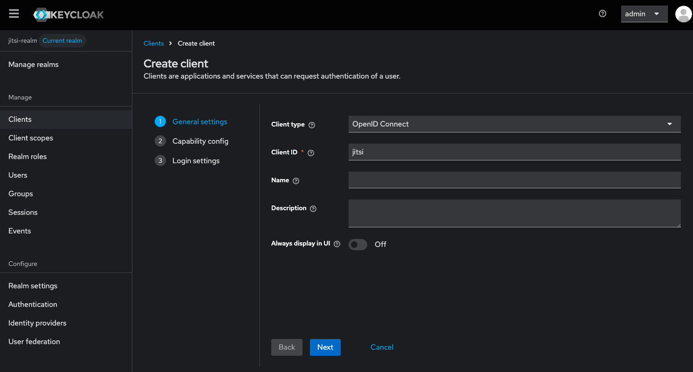
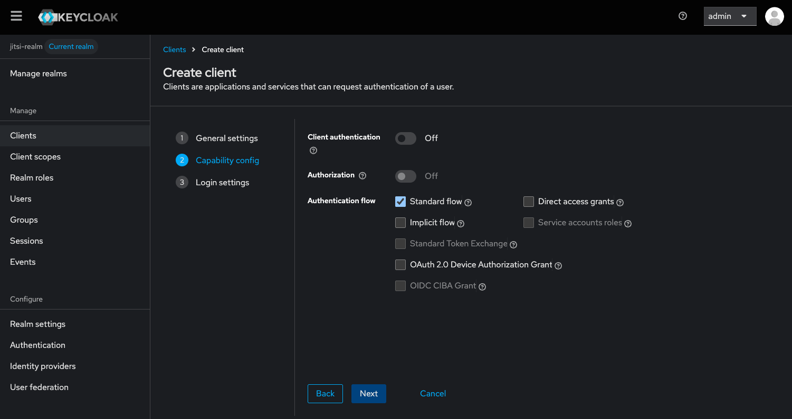
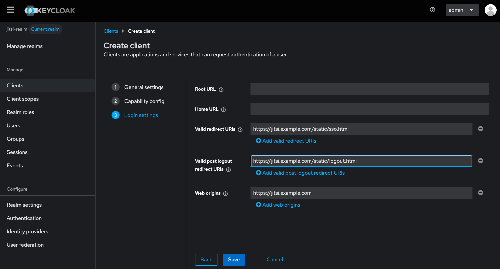
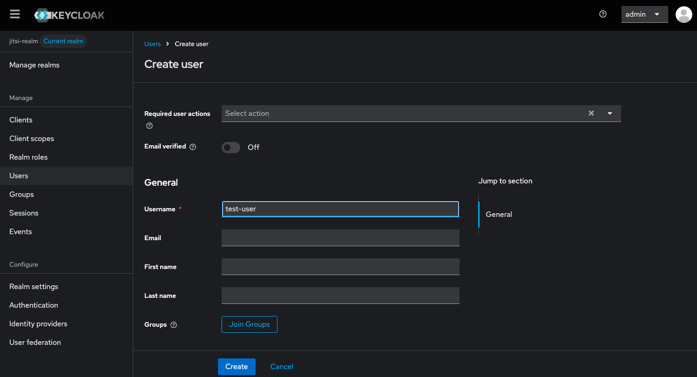
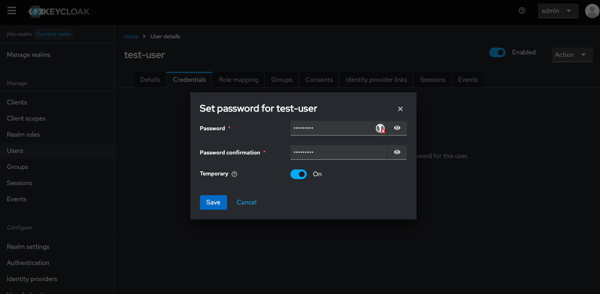

It is possible to allow only authenticated users to create new conference rooms.
Whenever a new room is about to be created, Jitsi Meet will prompt for a user
name and password. After the room is created, others will be able to join from
anonymous domain. Here's what has to be configured:

## Keycloak install and configure
Install docker and prepare keycloak user. 
```
curl -fsSL https://download.docker.com/linux/ubuntu/gpg -o /etc/apt/keyrings/docker.asc
sudo chmod a+r /etc/apt/keyrings/docker.asc

sudo tee /etc/apt/sources.list.d/docker.sources <<EOF
Types: deb
URIs: https://download.docker.com/linux/ubuntu
Suites: $(. /etc/os-release && echo "${UBUNTU_CODENAME:-$VERSION_CODENAME}")
Components: stable
Signed-By: /etc/apt/keyrings/docker.asc
EOF
apt update

apt install docker-ce docker-ce-cli containerd.io docker-buildx-plugin docker-compose-plugin
systemctl start docker

sudo useradd -r -m -s /bin/bash keycloak
sudo usermod -aG docker keycloak
sudo mkdir -p /home/keycloak/keycloak-data 
sudo chown -R keycloak:keycloak /home/keycloak/keycloak-data
sudo su - keycloak
```

Create .env file. Fill in your host and admin password:
```
KC_VERSION=26.2.3
KEYCLOAK_ADMIN_PASSWORD=admin
```

Create Dockerfile:
```
ARG KC_VERSION

FROM quay.io/keycloak/keycloak:${KC_VERSION} AS builder

ARG KC_VERSION
RUN /opt/keycloak/bin/kc.sh build

FROM quay.io/keycloak/keycloak:${KC_VERSION}
COPY --from=builder /opt/keycloak/ /opt/keycloak/

ENTRYPOINT ["/opt/keycloak/bin/kc.sh", "start", "--optimized"]
```

And docker-compose.yml file:
```
services:
  keycloak:
    build:
      context: .
      args:
        - KC_VERSION=${KC_VERSION}
    container_name: keycloak
    environment:
      - KC_HTTP_ENABLED=true
      - KC_HOSTNAME_STRICT=false
      - KC_PROXY=edge
      - KEYCLOAK_ADMIN=admin
      - KEYCLOAK_ADMIN_PASSWORD=${KEYCLOAK_ADMIN_PASSWORD}
    volumes:
      - ./keycloak-data:/opt/keycloak/data
    ports:
      - "18080:8080"
    restart: unless-stopped
```

Start it:
```
docker compose up -d --build
```

Open the Keycloak admin console at http://localhost:18080/admin/.
If you are running Keycloak on a remote machine you can use ssh port forwarding to access the admin console, for example:
```
ssh -L18080:localhost:8080 user@remote-machine
```

You need to create a realm, name it `jitsi-realm`, and select it.


Add new client in the realm, name it jitsi. When creating the client make sure you set for "Valid Redirect URIs":
`https://jitsi.example.com/static/sso.html` and for "Valid post logout redirect URIs": `https://jitsi.example.com/static/logout.html`.
And for "Web origins": `https://jitsi.example.com`. Replace `jitsi.example.com` with your own hostname.





In your nginx configuration for jitsi, you need to add the following lines to the server block somewhere before `/xmpp-websocket`:
```
   location ~ ^/realms/(.*) {
        proxy_pass http://localhost:18080; # Or your Keycloak instance address
        proxy_set_header Host $host;
        proxy_set_header X-Real-IP $remote_addr;
        proxy_set_header X-Forwarded-For $proxy_add_x_forwarded_for;
        proxy_set_header X-Forwarded-Proto $scheme;
    }
```

Go to "Realm Settings" → "General tab" and for "Frontend URL" set `https://jitsi.example.com`. Replace `jitsi.example.com` with your own hostname.


In "Users" create a new user. After creating the user, go to "Credentials" tab of the user and set a password for the user. You will need it later.


More information about keycloak and running it with docker can be found in the official documentation: https://www.keycloak.org/getting-started/getting-started-docker

## Prosody configuration

If you have installed Jitsi Meet from the Debian package, these changes should
be made in `/etc/prosody/conf.avail/[your-hostname].cfg.lua`

In the example below, this hostname is assumed to be `jitsi.example.com`. Update
this value according to your own hostname.

### Enable authentication

Inside the `VirtualHost "[your-hostname]"` section, replace anonymous
authentication with token authentication:

```
asap_accepted_issuers = { "https://jitsi.example.com/realms/jitsi-realm" }
asap_accepted_audiences = { "account" }
asap_require_room_claim = false;

VirtualHost "jitsi.example.com"
    authentication = "token"
    app_id = "jitsi"
    allow_empty_token = false
    cache_keys_url = "https://jitsi.example.com/realms/jitsi-realm/protocol/openid-connect/certs"
```

You will see your own hostname instead of `jitsi.example.com` in your config
file.

### Enable anonymous login for guests

Add this section **after the previous VirtualHost** to enable the anonymous
login method for guests:

```
VirtualHost "guest.jitsi.example.com"
    authentication = "jitsi-anonymous"
    c2s_require_encryption = false
    modules_enabled = {
        "smacks";
    }
```

_Note that `guest.jitsi.example.com` is internal to Jitsi, and you do not need
to (and should not) create a DNS record for it, or generate an SSL/TLS
certificate, or do any web server configuration. While it is internal, you
should still replace `jitsi.example.com` with your hostname._

### Enable wait for host module
Enable the `wait_for_host` module under the main muc component and enable `persistent_lobby`
```
VirtualHost "jitsi.example.com"
    authentication = "token"
    ...
    modules_enabled = {
        ...
        "persistent_lobby";
        ...
    }

Component "conference.jitsi.example.com" "muc"`
    modules_enabled = {
        ...
        "muc_wait_for_host";
        ...
    }
```

## Jitsi Meet configuration

In config.js, the `anonymousdomain` options has to be set.

If you have installed jitsi-meet from the Debian package, these changes should
be made in `/etc/jitsi/meet/[your-hostname]-config.js`.

```
var config = {
    hosts: {
        domain: 'jitsi.example.com',
        anonymousdomain: 'guest.jitsi.example.com',
        // ...
    },
    // ...
}
```

You will see your own hostname instead of `jitsi.example.com` in your config
file. You should add only the `anonymousdomain` line. Be careful of commas.

Set the token authentication URLs in the same file at the end append:
```
config.tokenAuthUrl='https://'+ config.hosts.domain + '/realms/jitsi-realm/protocol/openid-connect/auth?client_id=jitsi&response_type=code&scope=openid&state={state}&redirect_uri=https://'+ config.hosts.domain + '/static/sso.html&code_challenge={code_challenge}&code_challenge_method=S256';
config.tokenLogoutUrl='https://'+ config.hosts.domain + '/realms/jitsi-realm/protocol/openid-connect/logout?post_logout_redirect_uri=https://'+ config.hosts.domain + '/static/logout.html';
config.tokenAuthUrlAutoRedirect=true;
config.tokenAuthInline=true;
config.sso={ ssoService: config.hosts.domain, tokenService: config.hosts.domain + '/realms/jitsi-realm/protocol/openid-connect', clientId: "jitsi" };
```

## Restart the services

Restart prosody and nginx as `root`.

```
systemctl restart prosody
systemctl restart nginx
```
