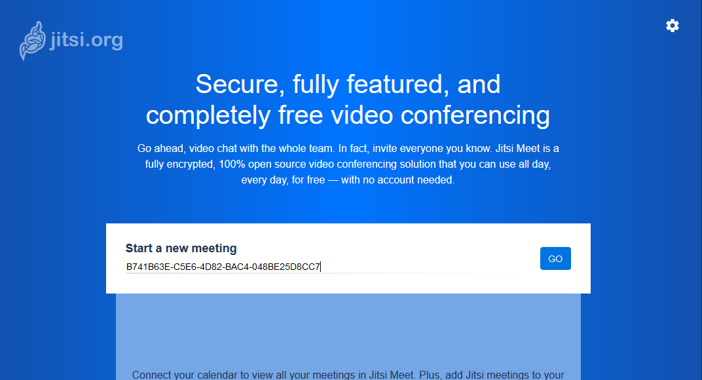
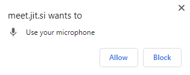
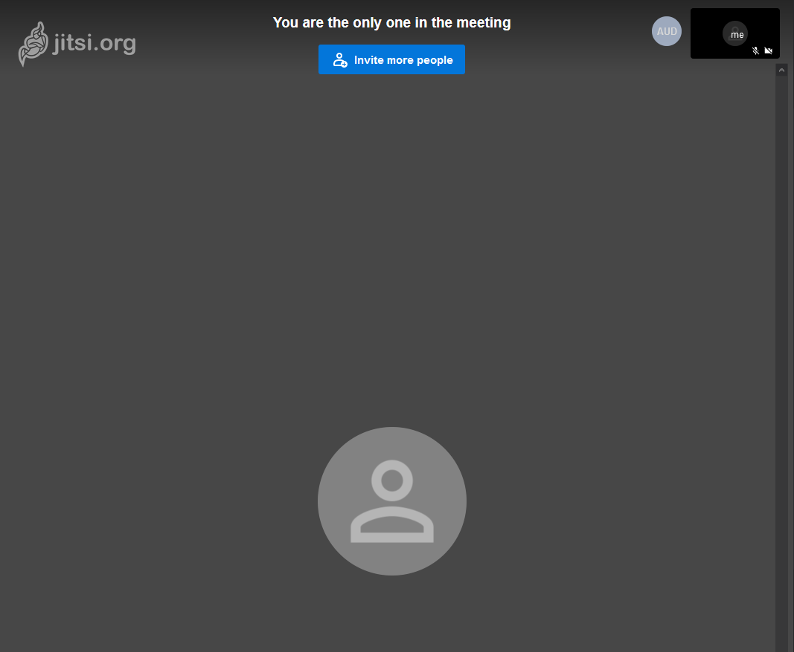
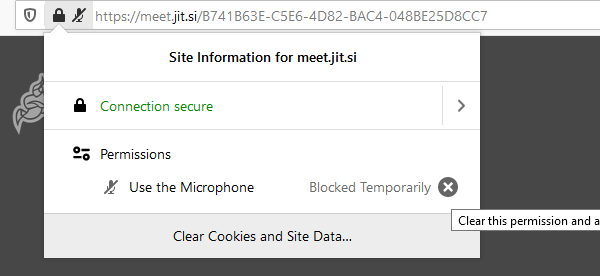

# Web browser clients

Jitsi is compatible with [these browsers](https://github.com/jitsi/jitsi-meet/wiki/Browser-support).

## _1. Open the following URL in your preferred browser_

```
https://meet.jit.si/
```

## _1. Type in the unique room name you were given or have created_

Upon creating a [secure room name](../faq#_2-use-a-different-room-name-for-each-meeting--conference-you-have_) type in the name in the input box of the website:



## _2. Grant access to the microphone and/or camera_

You can use the pop up window to grant access to the PC's microphone/camera.




## _3. You should now be in the conference_




**N.B. If you have Blocked access by accident you can allow access from the address bar**



