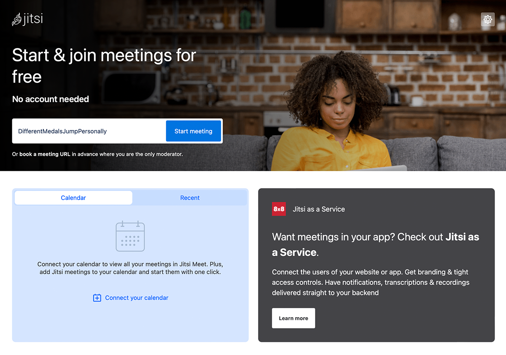
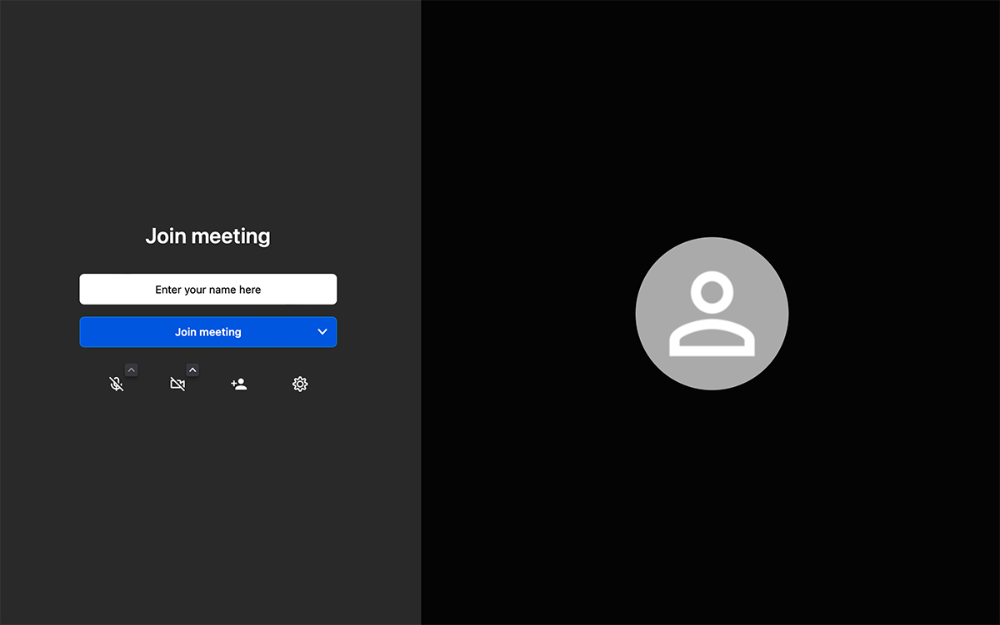

## Desktop Browser

1. You need a browser (please note our separate information)
2. Open the browser and in the address bar type, for example "https://meet.jit.si" (without "") and press <kbd>Enter<kbd>.
3. The page opens as shown in the figure:

4. Now enter a name for your conference (e.g. new meeting) in the "Start new meeting" field.
Note: Please do not use any special characters, spaces or umlauts, as this can lead to problems.
Note: Jitsi offers a functionality that automatically suggests names for the conferences. These can be overwritten.
5. Click the blue `Go` button.
6. The following window opens:

7. It is possible that no picture of you will appear at first. To do this, the browser will ask you whether you want to allow camera access. Please confirm this by clicking on `allow` or `permit`. Sometimes you also have to click the camera button at the bottom of the screen first to activate the dialog for allowing camera access. Do the same with the microphone the first time you use Jitsi.
8. Now enter your display name in the "enter your name" field.
9. Click the blue `Join meeting` button.
10. Have fun in your first conference.

## Mobile Browser
 
 # tbd

