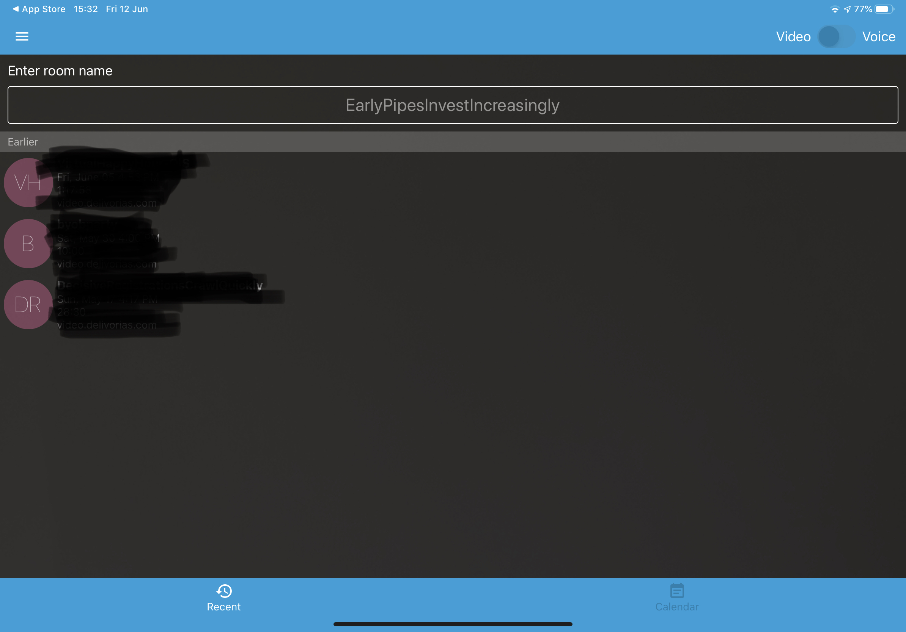

## _1. Create a new meeting room_

If a meeting room doesn't already exist then a new one is created by default. No name selection is really important.

In order to create a new meeting room you can type the following URL:
```
https://meet.jit.si/B741B63E-C5E6-4D82-BAC4-048BE25D8CC7
```
or you can use the automatically generated strong name, eg. **EarlyPipesInvestIncreasingly** which has a high probability of uniqueness. This name generator updates every few seconds. You'll need to share the meeting room and the password, if you've set one up, to all the participants.


