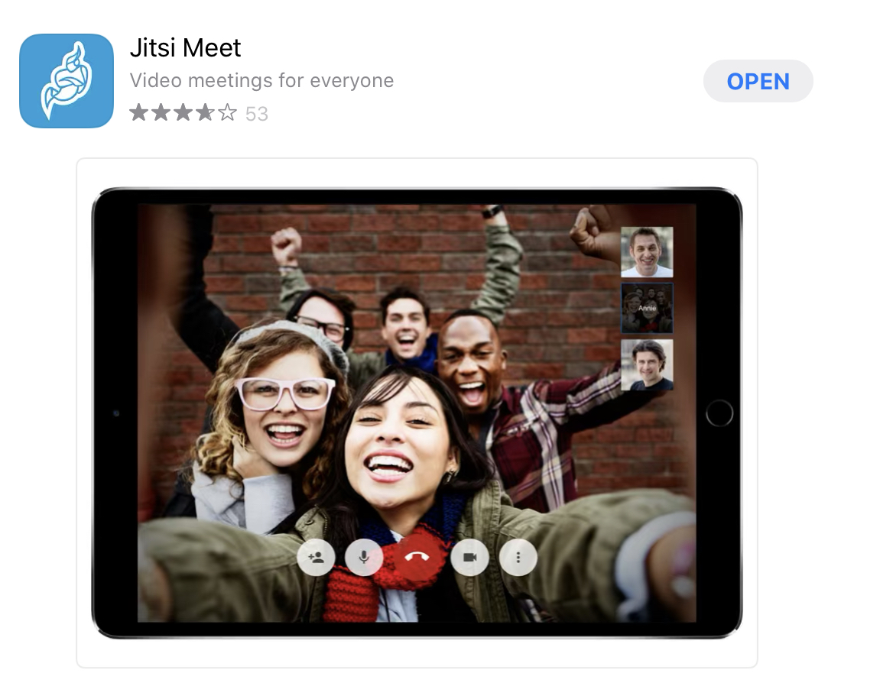
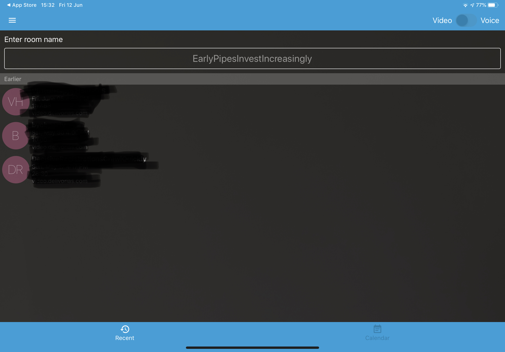

# Mobile Clients

## iOS

## _1. Make sure you've installed the most up-to-date application from the App Store_



## _2. Once you open the app you are able to type in the full address of the meeting room_

For example you can type the following URL:
```
https://meet.jit.si/B741B63E-C5E6-4D82-BAC4-048BE25D8CC7
```
or you can use the automatically generated strong name, eg. **EarlyPipesInvestIncreasingly** which has a high probability of uniqueness. This name generator updates every few seconds. You'll need to share the meeting room and the password, if you've set one up, to all the participants.



**N.B. Previous meeting rooms will appear below for future ease of use**


## Android

Check back soon!
