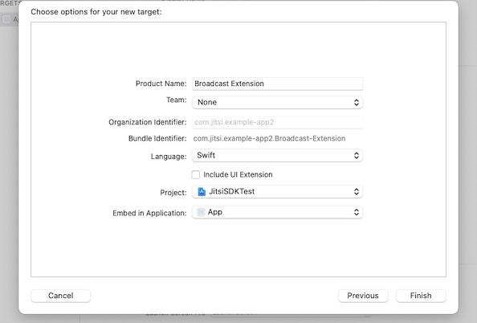
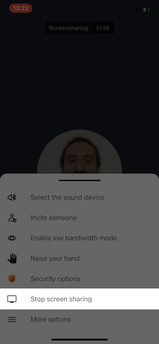
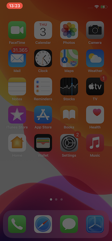

Le SDK Jitsi Meet iOS offre la même expérience utilisateur que l'application Jitsi Meet, d'une manière personnalisable que vous pouvez intégrer dans vos applications.

:::important
iOS 12 ou supérieur est requis.
:::

## Sample applications using the SDK

Si vous voulez voir à quel point il est facile d'intégrer le SDK Jitsi Meet dans une application native, jetez un œil au
[exemple de référentiel d'applications](https://github.com/jitsi/jitsi-meet-sdk-samples).

## Usage

Il existe 2 façons d'intégrer le SDK dans votre projet :

- Using CocoaPods
- Building it yourself

### Using CocoaPods

La méthode recommandée pour utiliser le SDK consiste à utiliser CocoaPods. Pour ce faire, ajoutez la dépendance `JitsiMeetSDK` à votre `Podfile` existant ou créez-en un nouveau en suivant cet exemple :

```
platform :ios, '12.0'

workspace 'JitsiMeetSDKTest.xcworkspace'

target 'JitsiMeetSDKTest' do
  project 'JitsiMeetSDKTest.xcodeproj'

  pod 'JitsiMeetSDK'
end

post_install do |installer|
  installer.pods_project.targets.each do |target|
    target.build_configurations.each do |config|
      config.build_settings['ENABLE_BITCODE'] = 'NO'
    end
  end
end
```

Remplacez `JitsiMeetSDKTest` par les noms de votre projet et de votre cible.

Le bitcode n'est pas fourni dans le SDK prédéfini, alors désactivez-le pour votre projet.

Le SDK utilise le code Swift, assurez-vous donc de sélectionner "Toujours intégrer les bibliothèques standard Swift"
dans votre projet.

Étant donné que le SDK demande l'accès à la caméra et au microphone, assurez-vous d'inclure les entrées requises pour `NSCameraUsageDescription` et `NSMicrophoneUsageDescription` dans votre fichier `Info.plist`.

Pour que l'application fonctionne correctement en arrière-plan, sélectionnez les modes d'arrière-plan "audio" et "voip".

Enfin, étant donné que le SDK affiche et masque la barre d'état en fonction de l'état de la conférence, vous pouvez définir `UIViewControllerBasedStatusBarAppearance` sur `NO` dans votre
Fichier `Info.plist`.

### Building it yourself

1. Installez toutes les [dépendances] requises(https://jitsi.github.io/handbook/docs/dev-guide/dev-guide-mobile-jitsi-meet).

2. Build it:

```bash
mkdir -p ios/sdk/out
xcodebuild clean \
    -workspace ios/jitsi-meet.xcworkspace \
    -scheme JitsiMeetSDK
xcodebuild archive \
    -workspace ios/jitsi-meet.xcworkspace \
    -scheme JitsiMeetSDK  \
    -configuration Release \
    -sdk iphonesimulator \
    -destination='generic/platform=iOS Simulator' \
    -archivePath ios/sdk/out/ios-simulator \
    VALID_ARCHS=x86_64 \
    ENABLE_BITCODE=NO \
    SKIP_INSTALL=NO \
    BUILD_LIBRARY_FOR_DISTRIBUTION=YES
xcodebuild archive \
    -workspace ios/jitsi-meet.xcworkspace \
    -scheme JitsiMeetSDK  \
    -configuration Release \
    -sdk iphoneos \
    -destination='generic/platform=iOS' \
    -archivePath ios/sdk/out/ios-device \
    VALID_ARCHS=arm64 \
    ENABLE_BITCODE=NO \
    SKIP_INSTALL=NO \
    BUILD_LIBRARY_FOR_DISTRIBUTION=YES
xcodebuild -create-xcframework \
    -framework ios/sdk/out/ios-device.xcarchive/Products/Library/Frameworks/JitsiMeetSDK.framework \
    -framework ios/sdk/out/ios-simulator.xcarchive/Products/Library/Frameworks/JitsiMeetSDK.framework \
    -output ios/sdk/out/JitsiMeetSDK.xcframework
```

Après avoir réussi à créer Jitsi Meet SDK pour iOS, le XCFramework résultant se trouvera dans le répertoire ios/sdk/out.

REMARQUE : Votre application devra dépendre du CocoaPod JitsiWebRTC.
## API

JitsiMeet est un framework iOS qui incarne toute l'expérience Jitsi Meet et la rend réutilisable par des applications tierces.

To get started:

1. Ajoutez un `JitsiMeetView` à votre application à l'aide d'un Storyboard ou d'un Interface Builder, par exemple.

2. Ensuite, une fois la vue chargée, définissez le délégué dans votre contrôleur et chargez l'URL souhaitée :

```objc
- (void)viewDidLoad {
  [super viewDidLoad];

  JitsiMeetView *jitsiMeetView = (JitsiMeetView *) self.view;
  jitsiMeetView.delegate = self;

  JitsiMeetConferenceOptions *options = [JitsiMeetConferenceOptions fromBuilder:^(JitsiMeetConferenceOptionsBuilder *builder) {
      builder.serverURL = [NSURL URLWithString:@"https://meet.jit.si"];
      builder.room = @"test123";
      builder.audioOnly = YES;
  }];

  [jitsiMeetView join:options];
}
```

### JitsiMeetView class

La classe `JitsiMeetView` est le point d'entrée du SDK. C'est une sous-classe de `UIView` qui rend une conférence complète dans la zone désignée.

#### delegate

Propriété pour obtenir/définir le `JitsiMeetViewDelegate` sur `JitsiMeetView`.

#### join:JitsiMeetConferenceOptions

Rejoint la conférence spécifiée par les options données.

```objc
  JitsiMeetConferenceOptions *options = [JitsiMeetConferenceOptions fromBuilder:^(JitsiMeetConferenceOptionsBuilder *builder) {
      builder.serverURL = [NSURL URLWithString:@"https://meet.jit.si"];
      builder.room = @"test123";
      builder.audioOnly = NO;
      builder.audioMuted = NO;
      builder.videoMuted = NO;
      builder.welcomePageEnabled = NO;
      [builder setConfigOverride:@"requireDisplayName" withBoolean:YES];
  }];

  [jitsiMeetView join:options];
```

#### leave

Quitte la conférence actuellement active.

#### hangUp

Le participant local quitte la conférence en cours.

#### setAudioMuted

Définit l'état de l'audio localParticipant coupé en fonction du paramètre "muet".

#### setVideoMuted

Définit l'état de la vidéo localParticipant désactivée en fonction du paramètre "muet".

#### sendEndpointTextMessage

Envoie un message via le canal de données à un participant particulier ou à tous.
Si le paramètre `to` est vide, le message sera envoyé à tous les participants à la conférence.

Afin d'obtenir le participantId, l'événement `PARTICIPANT_JOINED` doit être écouté, lequel `data` inclut l'identifiant et celui-ci doit être stocké d'une manière ou d'une autre.

#### toggleScreenShare

Définit l'état du partage d'écran localParticipant en fonction du paramètre "enabled".

#### openChat

Ouvre la boîte de dialogue de discussion. Si `to` contient un participantId valide, le chat privé avec ce participant particulier sera ouvert.

#### sendChatMessage

Envoie un message de chat via à un participant en particulier ou à tous.
Si le paramètre `to` est vide, le message sera envoyé à tous les participants à la conférence.

Afin d'obtenir le participantId, l'événement `PARTICIPANT_JOINED` doit être écouté, lequel `data` inclut l'identifiant et celui-ci doit être stocké d'une manière ou d'une autre.

#### closeChat

Ferme la boîte de dialogue de discussion.

#### retrieveParticipantsInfo

Récupère les informations des participants dans le CompletionHandler envoyé en paramètre.

#### Universal / deep linking

Afin de prendre en charge les liens universels / profonds, `JitsiMeet` propose 2 méthodes de classe que le délégué de votre application doit appeler pour que l'application suive ces liens.

Si ces fonctions renvoient NON, cela signifie que l'URL n'a pas été gérée par le SDK. Ceci est utile lorsque l'application hôte utilise d'autres SDK qui utilisent également la liaison.

```objc
-  (BOOL)application:(UIApplication *)application
continueUserActivity:(NSUserActivity *)userActivity
  restorationHandler:(void (^)(NSArray *restorableObjects))restorationHandler
{
  return [[JitsiMeet sharedInstance] application:application
               continueUserActivity:userActivity
                 restorationHandler:restorationHandler];
}
```

And also one of the following:

```objc
// See https://developer.apple.com/documentation/uikit/uiapplicationdelegate/1623073-application?language=objc
- (BOOL)application:(UIApplication *)app
            openURL:(NSURL *)url
            options:(NSDictionary<UIApplicationOpenURLOptionsKey,id> *)options {
  return [[JitsiMeet sharedInstance] application:app
                            openURL:url
                            options: options];
}
```

### JitsiMeetViewDelegate

Ce délégué est facultatif et peut être défini sur l'instance `JitsiMeetView` à l'aide de la propriété `delegate`.

Il fournit des informations sur l'état de la conférence : a-t-elle été rejointe, quittée, a-t-elle échoué ?

Toutes les méthodes de ce délégué sont facultatives.

#### conferenceJoined

Called when a conference was joined. `data` contains the following information:

- `url`: the conference URL

#### conferenceTerminated

Appelé lorsque la conférence active se termine, que ce soit à cause du choix de l'utilisateur ou à cause d'un échec. `data` contient le
information suivante:

- `url`: l'URL de la conférence
- `error`: manquant si la conférence s'est bien terminée, sinon contient le message d'erreur

#### conferenceWillJoin

Appelé avant de rejoindre une conférence. `data` contient les informations suivantes :

- `url`: l'URL de la conférence

#### enterPictureInPicture

Appelé lors de la saisie d'une image dans l'image demandée par l'utilisateur. L'application devrait maintenant activer son implémentation Picture-in-Picture (et redimensionner le `JitsiMeetView` associé. Ce dernier détectera automatiquement sa nouvelle taille et ajustera son interface utilisateur à une variante appropriée à la petite taille habituellement associée à Picture-in-Picture .)

Le dictionnaire `data` est vide.

#### participantJoined

Appelé lorsqu'un participant a rejoint la conférence. `data` contient les informations suivantes :

- `email`: l'e-mail du participant. Il peut ne pas être défini si le participant distant n'en a pas défini.
- `name`: le nom du participant.
- `role`: le rôle du participant.
- `participantId`: l'identifiant du participant.

#### participantLeft

Appelé lorsqu'un participant a quitté la conférence. `data` contient les informations suivantes :

- `participantId` : l'identifiant du participant qui est parti.

#### audioMutedChanged

Appelé lorsque le son du participant local est coupé ou rétabli. `data` contient les informations suivantes :

- `muted` : un booléen indiquant si l'audio est coupé ou non.

#### videoMutedChanged

Appelé lorsque la vidéo du participant local est désactivée ou activée. `data` contient les informations suivantes :

- `muted` : un entier indiquant si la vidéo est muette ou non. 0 signifie activé, 4 signifie désactivé.

#### endpointTextMessageReceived

Appelé lorsqu'un message texte de point de terminaison est reçu.

Le dictionnaire `data` contient une clé `senderId` avec le participantId de l'expéditeur et une clé `message` avec le
teneur.

#### screenShareToggled

Appelé lorsqu'un message de chat est reçu.

Le dictionnaire `data` contient une clé `participantId` avec l'identifiant du participant et une clé 'sharing' avec un booléen
évaluer.

#### chatMessageReceived

Appelé lorsqu'un SMS de chat est reçu. `data` contient les informations suivantes :

- `senderId`: l'identifiant du participant qui a envoyé le message.
- `message`: le contenu du message.
- `isPrivate`: true si le message est privé, false sinon.
- `timestamp`: l'horodatage (facultatif) du message.

#### chatToggled

Appelé lorsque la boîte de dialogue de discussion est ouverte ou fermée. `data` contient les informations suivantes :

- `isOpen` : vrai si la boîte de dialogue de discussion est ouverte, faux sinon.

#### readyToClose

Appelé lorsque le SDK est prêt à être fermé. Aucune réunion n'a lieu à ce stade.

### Picture-in-Picture

`JitsiMeetView` ajustera automatiquement son interface utilisateur lorsqu'il sera présenté dans un
Scénario de style Picture-in-Picture, dans un rectangle trop petit pour accueillir son interface utilisateur "complète".

Jitsi Meet SDK n'implémente pas actuellement l'image dans l'image native sur iOS. Si vous le souhaitez, les applications doivent implémenter elles-mêmes une image dans l'image non native et redimensionner "JitsiMeetView".

Si `delegate` implémente `enterPictureInPicture:`, la barre d'outils en cours d'appel affichera un bouton permettant à l'utilisateur de demander la saisie d'une image dans l'image.

## Dropbox integration

Pour configurer l'intégration Dropbox, procédez comme suit :

1. Ajoutez ce qui suit à la liste Info.plist de l'application et remplacez `<APP_KEY>` par votre
Dropbox app key:
```
<key>CFBundleURLTypes</key>
<array>
  <dict>
    <key>CFBundleURLName</key>
    <string></string>
    <key>CFBundleURLSchemes</key>
    <array>
      <string>db-<APP_KEY></string>
    </array>
  </dict>
</array>
<key>LSApplicationQueriesSchemes</key>
<array>
  <string>dbapi-2</string>
  <string>dbapi-8-emm</string>
</array>
```

2. Assurez-vous que votre application appelle les méthodes déléguées universelles/de liaison profonde Jitsi Meet SDK.

## Screen Sharing integration

La fonctionnalité de partage d'écran pour iOS a été ajoutée à Jitsi à partir de la version 3.3.0 de JitsiMeetSDK. Il est disponible pour les applications fonctionnant sur iOS 14 ou plus récent.

Pour ce faire, nous utilisons l'extension "Broadcast Upload" pour capturer le contenu de l'écran de l'utilisateur. La transmission des trames au RN WebRTC se fait à l'aide d'une communication par sockets orientée flux Unix, l'extension jouant le rôle de client et le React Native WebRTC étant le serveur.

La documentation suivante couvre le code fourni dans le [exemple d'application](https://github.com/jitsi/jitsi-meet-sdk-samples/tree/master/ios/swift-screensharing/JitsiSDKScreenSharingTest).

### Creating the Broadcast Upload Extension

L'extension de téléchargement de diffusion est l'un des types d'extensions d'application définis dans iOS et est utilisée pour capturer le contenu de l'écran de l'utilisateur.

Pour créer l'extension, vous devez ajouter une nouvelle cible à votre application, en sélectionnant le modèle "Broadcast Upload Extension". Remplissez le nom souhaité, changez la langue en Swift, assurez-vous que "Inclure l'extension de l'interface utilisateur" n'est pas sélectionné, car nous n'avons pas besoin d'interface utilisateur personnalisée pour notre cas, puis appuyez sur Terminer (capture d'écran 1). Vous verrez qu'un nouveau dossier avec le nom de l'extension a été ajouté à l'arborescence du projet, contenant la classe `SampleHandler.swift`. Assurez-vous également de mettre à jour les « informations de déploiement », pour l'extension nouvellement créée, vers iOS 14 ou une version plus récente. Pour en savoir plus sur la création d'extensions d'application, consultez la [documentation officielle](https://developer.apple.com/library/archive/documentation/General/Conceptual/ExtensibilityPG/ExtensionCreation.html).



Une fois l'extension créée, les étapes suivantes consistent à configurer la connexion socket, à ajouter la fonctionnalité de gestion des trames reçues et à les envoyer à RN WebRTC pour traitement. Nous utiliserons le code fourni avec l'exemple de projet pour cela. Copiez les fichiers `SampleUploader.swift`, `SocketConnection.swift`, `DarwinNotificationCenter.swift` et `Atomic.swift` dans le dossier de votre extension et assurez-vous qu'ils sont ajoutés à la cible.

### Setting up the socket connection

L'envoi des trames enregistrées vers RN WebRTC se fait via les sockets Unix SOCK_STREAM. L'extension doit être configurée en tant que point de terminaison client pour cela.

Nous mettrons à jour `SampleHandler.swift` pour initier la connexion socket avec RN WebRTC, en utilisant la classe `SocketConnection`. Mais avant, nous devons configurer le fichier que les sockets utiliseront pour la communication.

Même si un groupe d'extensions d'application est imbriqué dans le groupe de son application contenante, l'extension d'application en cours d'exécution et l'application contenante n'ont pas d'accès direct aux conteneurs de l'autre. Nous allons résoudre ce problème en permettant le partage de données. Pour activer le partage de données, utilisez Xcode ou le portail des développeurs pour activer les groupes d'applications pour l'application contenante et ses extensions d'application contenues. Ensuite, enregistrez le groupe d'applications dans le portail et spécifiez le groupe d'applications à utiliser dans l'application contenante. Pour en savoir plus sur l'utilisation des groupes d'applications, consultez [Ajout d'une application à un groupe d'applications](https://developer.apple.com/library/archive/documentation/Miscellaneous/Reference/EntitlementKeyReference/Chapters/EnablingAppSandbox.html#//apple_ref/doc/uid/TP40011195-CH4-SW19).

Maintenant, ajoutez un `private var socketFilePath: String` à votre classe `SampleHandler` et configurez-le avec un fichier partagé nommé `rtc_SSFD`, en utilisant le groupe d'applications nouvellement enregistré, comme ceci :
```
private enum Constants {
    static let appGroupIdentifier = "my.custom.app.group"
}

private var socketFilePath: String {
    let sharedContainer = FileManager.default.containerURL(forSecurityApplicationGroupIdentifier: Constants.appGroupIdentifier)
     
    return sharedContainer?.appendingPathComponent("rtc_SSFD").path ?? ""
}
```

Ensuite, nous allons configurer `SocketConnection` pour utiliser le fichier partagé. Ajoutez un `private var clientConnection : SocketConnection ?` à la classe `SampleHandler` et remplacez `init` pour le configurer, comme ceci :
```
override init() {
    super.init()
    if let connection = SocketConnection(filePath: socketFilePath) {
        clientConnection = connection
    }
} 
```

Pour que cela fonctionne, l'extrémité RN WebRTC doit connaître l'identifiant du groupe d'applications avec lequel nous avons configuré l'application. Pour ce faire, nous ajoutons une nouvelle clé nommée `RTCAppGroupIdentifier` au `Info.plist` de l'application avec l'identifiant du groupe d'applications comme valeur.

### Opening the socket connection

Pour démarrer le partage d'écran, JitsiMeet SDK fournit l'interface utilisateur pour présenter le "RPSystemBroadcastPickerView" à l'utilisateur. Par défaut, le sélecteur affichera une liste de tous les fournisseurs de diffusion disponibles. Afin de limiter le sélecteur à notre fournisseur de diffusion particulier, nous devons définir `preferredExtension` sur l'identifiant de bundle de l'extension de diffusion. Pour ce faire, nous ajoutons une nouvelle clé nommée "RTCScreenSharingExtension" au fichier Info.plist de l'application et définissons l'identifiant du groupe d'extensions de diffusion comme valeur.

Une fois que l'enregistrement d'écran a commencé, ReplayKit invoque les méthodes pour gérer les tampons vidéo, ainsi que les méthodes pour gérer le démarrage et l'arrêt de la diffusion, à partir de la classe "SampleHandler". La méthode `broadcastStarted(withSetupInfo:)` est notre point d'entrée pour ouvrir la connexion socket avec le serveur RN WebRTC. Pour ce faire, nous devons publier la notification `broadcastStarted` que le serveur écoute, afin de démarrer la connexion, et nous sommes prêts à nous connecter. Ajoutez une nouvelle méthode `openConnection()` à la classe `SampleHandler` qui tentera à plusieurs reprises de se connecter au serveur, pour les cas où le démarrage de la connexion au serveur est retardé :
```
func openConnection() {
    let queue = DispatchQueue(label: "broadcast.connectTimer")
    let timer = DispatchSource.makeTimerSource(queue: queue)
    timer.schedule(deadline: .now(), repeating: .milliseconds(100), leeway: .milliseconds(500))
    timer.setEventHandler { [weak self] in
        guard self?.clientConnection?.open() == true else {
            return
        }
        
        timer.cancel()
    }
    
    timer.resume()
}
```

Ensuite, mettez à jour la méthode `broadcastStarted(withSetupInfo:)` pour publier la notification et vous connecter :
```
override func broadcastStarted(withSetupInfo setupInfo: [String: NSObject]?) {
    DarwinNotificationCenter.shared.postNotification(.broadcastStarted)
    openConnection()
}
```

`DarwinNotificationCenter` est une simple classe d'assistance pour la diffusion de notifications à l'échelle du système, au lieu de ne les diffuser qu'au sein d'un seul programme, comme le fait `NSNotificationCenter`. Ce mécanisme permet à l'application de s'inscrire aux notifications envoyées depuis l'extension.

Nous sommes maintenant prêts à commencer à envoyer des images vidéo.

### Sending video frames

RN WebRTC est conçu pour fonctionner avec des images codées jpeg encadrées dans un objet `CFHTTPMessage`. Les champs d'en-tête suivants sont obligatoires :
- `Content-Length` - la taille des données jpeg
- `Buffer-Width` - la largeur du tampon, en pixels
- `Buffer-Height` - la hauteur du tampon, en pixels
- `Buffer-Orientation` - la valeur de `RPVideoSampleOrientationKey` qui décrit l'orientation de la vidéo.

Nous allons préparer et envoyer nos images vidéo en utilisant la classe `SampleUploader`. Ajoutez un nouveau `private var uploader: SampleUploader?` à la classe SampleHandler et mettez à jour `init()` pour l'initialiser :
```
override init() {
    super.init()
    if let connection = SocketConnection(filePath: socketFilePath) {
      clientConnection = connection
      uploader = SampleUploader(connection: connection)
    }
}
```

Ensuite, nous allons mettre à jour la méthode `processSampleBuffer(_ sampleBuffer: CMSampleBuffer, with sampleBufferType: RPSampleBufferType)` pour envoyer nos images vidéo. Pour des raisons de performances, nous allons également implémenter un mécanisme très simple pour ajuster la fréquence d'images en utilisant une image sur trois. Ajoutez un nouveau `private var frameCount = 0` et mettez à jour la méthode mentionnée ci-dessus comme ceci :
```
override func processSampleBuffer(_ sampleBuffer: CMSampleBuffer, with sampleBufferType: RPSampleBufferType) {
    switch sampleBufferType {
    case .video:
        // very simple mechanism for adjusting frame rate by using every third frame
        frameCount += 1
        if frameCount % 3 == 0 {
            uploader?.send(sample: sampleBuffer)
        }
    default:
        break
    }
}
```

Mettez également à jour `broadcastStarted(withSetupInfo setupInfo: [String: NSObject]?)` pour réinitialiser le `frameCount` à chaque démarrage du partage d'écran :
```
override func broadcastStarted(withSetupInfo setupInfo: [String: NSObject]?) {
    frameCount = 0
    
    DarwinNotificationCenter.shared.postNotification(.broadcastStarted)
    openConnection()
}
```

Avec cela, nous avons conclu l'envoi des images vidéo et nous pouvons passer à la dernière étape, la gestion de l'arrêt du partage d'écran.

### Handling stop screen sharing

Outre l'interface utilisateur en réunion (capture d'écran 2), l'intégration de ReplayKit avec iOS permet d'arrêter l'enregistrement d'écran en dehors du contrôle de l'application, à partir de la barre d'état (capture d'écran 3) ou à l'aide du centre de contrôle (capture d'écran 4).

   

Chacune de ces actions déclenchera `broadcastFinished` dans notre implémentation `SampleHandler`. C'est notre point d'entrée pour fermer la connexion et nettoyer. Nous mettrons à jour `broadcastFinished` pour publier une notification à l'échelle du système `DarwinNotification.broadcastStopped` et fermer la connexion :
```
override func broadcastFinished() {
    DarwinNotificationCenter.shared.postNotification(.broadcastStopped)
    clientConnection?.close()
}
```

Un autre scénario dont nous devons nous occuper est lorsque la connexion au serveur est interrompue, comme lorsque vous quittez une réunion pendant le partage d'écran ou qu'une erreur est rencontrée. Nous allons résoudre ce problème en gérant l'événement `clientConnection.didClose`. Ajoutez une nouvelle méthode `setupConnection` à la classe `SampleHandler` et mettez à jour `init` pour l'appeler :
```
func setupConnection() {
    clientConnection?.didClose = { [weak self] error in      
        if let error = error {
            self?.finishBroadcastWithError(error)
        } else {
            // the displayed failure message is more user friendly when using NSError instead of Error
            let JMScreenSharingStopped = 10001
            let customError = NSError(domain: RPRecordingErrorDomain, code: JMScreenSharingStopped, userInfo: [NSLocalizedDescriptionKey: "Screen sharing stopped"])
            self?.finishBroadcastWithError(customError)
        }
    }
}

override init() {
    super.init()
    if let connection = SocketConnection(filePath: socketFilePath) {
      clientConnection = connection
      setupConnection()
      
      uploader = SampleUploader(connection: connection)
    }
}
```

Maintenant que nous avons fini d'écrire l'implémentation, il nous suffit d'activer la fonctionnalité dans Jitsi. Nous faisons cela en configurant `JitsiMeetConferenceOptionsBuilder` avec le drapeau `ios.screensharing.enabled feature`, comme ceci :
```
let options = JitsiMeetConferenceOptions.fromBuilder { [weak self] builder in
    ...
    builder.setFeatureFlag("ios.screensharing.enabled", withBoolean: true)
}
meetView.join(options)
```

Enfin, nous sommes prêts à tester la mise en œuvre. Avant de le faire, assurez-vous que voip est ajouté à `UIBackgroundModes`, dans `Info.playlist` de l'application, afin de fonctionner lorsque l'application est en arrière-plan.

### TL;DR

- Ajoutez une `Broadcast Upload Extension`, sans interface utilisateur, à votre application. Mettez à jour les informations de déploiement pour une exécution dans iOS 14 ou une version plus récente.
- Copiez les fichiers `SampleUploader.swift`, `SocketConnection.swift`, `DarwinNotificationCenter.swift` et `Atomic.swift` de l'exemple de projet vers votre extension. Assurez-vous qu'ils sont ajoutés à la cible de l'extension.
- Ajoutez à la fois l'application et l'extension au même groupe d'applications. Ensuite, ajoutez la valeur de l'ID de groupe d'applications au `Info.plist` de l'application pour la clé `RTCAppGroupIdentifier`.
- Ajoutez une nouvelle clé `RTCScreenSharingExtension` au `Info.plist` de l'application avec `Bundle Identifier` de l'extension comme valeur.
- Mettez à jour `SampleHandler.swift` avec le code de l'exemple de projet. Mettez à jour la constante `appGroupIdentifier` avec le nom du groupe d'applications auquel votre application et votre extension sont toutes deux enregistrées.
- Mettez à jour `JitsiMeetConferenceOptions` pour activer le partage d'écran à l'aide de l'indicateur de fonctionnalité `ios.screensharing.enabled`.
- Assurez-vous que `voip` est ajouté à `UIBackgroundModes`, dans `Info.plist` de l'application, afin de fonctionner lorsque l'application est en arrière-plan.
