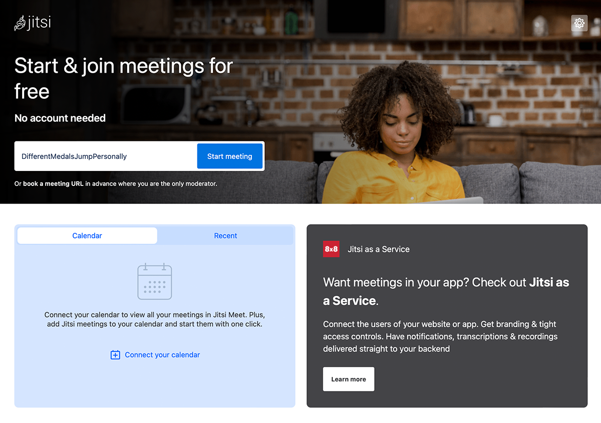
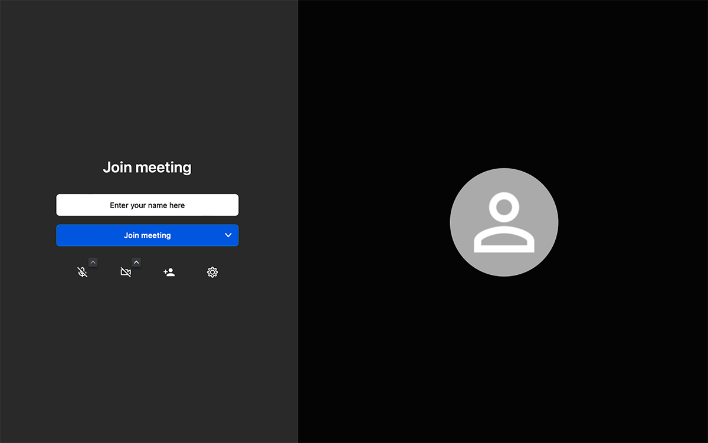

## Navigateur de bureau ou mobile

1. Vous avez besoin d'un navigateur (veuillez noter nos informations séparées).
2. Ouvrez le navigateur et dans la barre d'adresse, tapez par exemple "https://meet.jit.si" (sans "") et appuyez sur <kbd>Entrée</kbd>.
3. La page s'ouvre comme indiqué sur la figure :

4. Entrez maintenant un nom pour votre conférence (par exemple, nouvelle réunion) dans le champ "Démarrer une nouvelle réunion".
REMARQUE: Veuillez ne pas utiliser de caractères spéciaux, d'espaces ou de trémas, car cela peut entraîner des problèmes.
REMARQUE: Jitsi propose une fonctionnalité qui suggère automatiquement des noms pour les conférences. Ceux-ci peuvent être écrasés.
5. Cliquez sur le bouton bleu "Go".
6. La fenêtre suivante s'ouvre :

7. Il est possible qu'aucune photo de vous n'apparaisse au début. Pour ce faire, le navigateur vous demandera si vous souhaitez autoriser l'accès à la caméra. Veuillez le confirmer en cliquant sur « autoriser » ou « autoriser ». Parfois, vous devez également cliquer sur le bouton de la caméra en bas de l'écran pour activer la boîte de dialogue permettant l'accès à la caméra. Faites de même avec le microphone la première fois que vous utilisez Jitsi.
8. Entrez maintenant votre nom d'affichage dans le champ "Entrez votre nom".
9. Cliquez sur le bouton bleu "Rejoindre la réunion".
10. Amusez-vous lors de votre première conférence.

:::note
Si vous ne voyez pas d'image vidéo de vous-même, vérifiez les points suivants :
La caméra de votre appareil est :
- présent (petite lentille en haut de l'écran / une webcam externe sur le moniteur),
- activée (sur certains ordinateurs portables, vous pouvez activer/désactiver activement la webcam),
- branché (uniquement nécessaire pour les webcams externes),
- installé (certains appareils nécessitent que la caméra soit installée en premier).
:::

:::note
Si vous ne pouvez pas transmettre le son, vérifiez les points suivants :
Le microphone de votre appareil est :
- disponible (en particulier avec les appareils de bureau, un microphone n'est jamais réellement intégré. Ici, vous avez besoin d'un microphone ou d'un casque externe, que vous connectez aux ports appropriés de votre PC),
- activé (sur certains ordinateurs portables avec microphone intégré ou casques, il y a un interrupteur pour activer / désactiver le microphone),
- branché (uniquement nécessaire pour les microphones externes),
- installé (sur certains anciens ordinateurs, le microphone doit être installé).
:::